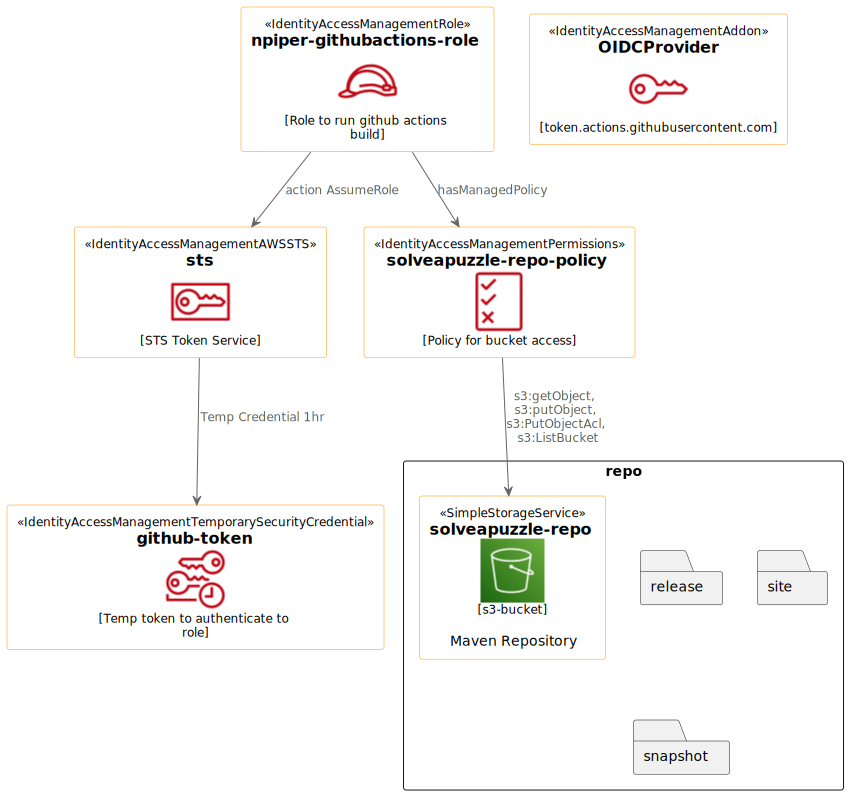

ifdef::env-github[]
:imagesdir: foo/
endif::[]

:icons: font
:toc:
:toc-placement!:

= Parent Organisation pom for neilpiper.me

toc::[]


Source code for the parent pom settings for the Organisation 'neilpiper.me'.

The pom is minimal with the intent of setting up the basic rules and properties for the neilpiper.me
organisation.  This allows other inheriting POM's to inherit those values.

Specific child POM's can then be created based on need such as Plain Java, Spring,  Activiti, Mulesoft, Node.js etc;

```
groupId: neilpiper.me
artifactId: parent.org

Current Major Version: 0
Suggested Maven Import Range:  (,1.0]  x <= 1.0
```

=== Version

[example]
====
0.3

https://github.com/npiper/npiper-parent-org/tags[Tags]
====

== How to use the Parent POM?

=== Pre-Requisites

 * AWS Storage Repo S3 for Repository
 * AWS CLI installed locally
 * Java/Maven installed
 * github account - OAuth token (to commit/push `mvn site` pages)

=== AWS Setup for S3 Repository

An S3 bucket (public access) has been created called `solveapuzzle-repo`, to avoid the need to keep AWS-credentials in github a role is created that 
can get an OpenIDConnect credential via a Github trusted authentication.  The role has minimal permissions to only be able to interact with the S3 bucket.




=== Create the AWS Role from CLI


*Role to be created*

```
arn:aws:iam::{account-id}:role/npiper-githubactions-role
```

*Running the AWS CLI*

Create an AWS session `aws configure` , the script needs parameters for the `GitHubOrg` and the `RepositoryName` to associate the role to.

```
Parameters:  
  GitHubOrg = npiper
  RepositoryName = npiper-parent-org


aws cloudformation create-stack --stack-name teststack --template-body file://$(pwd)/role-cloudformation.yaml --parameters ParameterKey=GitHubOrg,ParameterValue=npiper ParameterKey=RepositoryName,ParameterValue=npiper-parent-org --capabilities CAPABILITY_NAMED_IAM
```


 * https://docs.aws.amazon.com/AWSCloudFormation/latest/UserGuide/using-cfn-cli-creating-stack.html[AWS Create a stack using the AWS CLI]
 * https://docs.aws.amazon.com/AWSCloudFormation/latest/APIReference/API_CreateStack.html[AWS API Reference - CloudFormation : CreateStack reference]


=== Parent POM - Release process

Tagging, Site documentation generation and deployment to the S3 Maven repository MUST only ever be done from the build server.

This is currently using Github Actions off the master branch.

*Build metadata:*
 * Github Actions build number
 * Git commit ID - short Ref

Project tags and the site documentation 'About' page give traceability of which CI tag and build the semantic version was built against.

icon:github[] https://npiper.github.io/npiper-parent-org[Github Pages: https://npiper.github.io/npiper-parent-org]

```
[Semantic Version]_[BuildNumber].[gitCommitId]
```

Use semantic versioning in your POM file to consider a release candidate of the change you are intending to make, and the CI server to guide the succesful build candidate to take forward.

Why: You know the change you are after,.. it might take a few builds and tests to get it so the code traceability is always built in.

The `.github/workflows/build_master.yml` build file should be structured to only permit these actions to happen on the build server.

A maven `<profile>` is used so it is not possible to do this locally (unless you need to debug.)

```
mvn site deploy scm:tag -Drevision=${TRAVIS_BUILD_NUMBER}.$(git rev-parse --short HEAD) -Dusername=${GIT_USER_NAME} -Dpassword=${GITPW}
```

== Using the npiper-parent-org and setting up a CI-CD repo

Use the shell script `gitsetup.sh` to create a project and appropriate branches for typical development.

```
- develop : development branch - trunk based development
- gh-pages : Github pages - a maven  and reports site will be deployed using a plugin
- master : semantic versioning and deployments run through this branch
```

=== Conventions to follow

Repository is in Github, as the site pages go to Github pages, and use Github actions for CI-CD. 
This should be effectively free for most developers.

`project.name` = Align to GIT repository name

Use git issue tracking (default)
When using `site` put published version into github pages as path `${project.name}`
Repository is the Amazon S3 solveapuzzle-repo for Deployment, retrieving any 'neipiper.me' dependencies.

=== Encrypt keys into Github Actions

The following encrypted variables are used on a succesful build and `mvn deploy` to the Release repository.

 * Git Tag and push site doco to gh-pages branch, push tag to master

[%hardbreaks]
icon:lock[role=green] GHBUILDEMAIL
icon:lock[role=green] GHOAUTH_SECRET_TOKEN 
icon:lock[role=green] GHUBUILDSER


_TO DO:  How to do this via curl, secrets must be encrypted/encoded before posting_

https://docs.github.com/en/rest/actions/secrets#create-or-update-a-repository-secret[Github - create or update a repository secret]


=== Choose the right Parent Version

Release versions can be browsed using the 'tags' https://github.com/npiper/npiper-parent-pom/tags[tags]

The parent versions can be browsed at: https://s3-ap-southeast-2.amazonaws.com/solveapuzzle-repo

Release Naming Convention:  *MAJOR.MINOR.PATCH* _BUILD.COMMIT*

_Release management and supported version changes should only be done off the master branch._

The following parent example inherits the highest version under v1.0.0.

```
  <parent>
    <groupId>neilpiper.me</groupId>
    <artifactId>parent.org</artifactId>
    <version>(,1.0]</version>
  </parent>
```

=== Set your project name

A lot of the project inherits location and github projects

```
  <name>hello-world</name>
```

=== Set / Override the Github Organisation

The default Github Organisation for this POM is `npiper`.

It is possible to overwrite the Organisation by setting this property in the Child POM.

```
<githubOrg>solveapuzzle-dev</githubOrg>
```

=== Add Repository , overwrite SCM URL in child 	

There's a need to redefine the `<scm>` tag in each child.

This is to workaround to an inconsistency in Maven that child projects scm tag, appends parent's pom name in pom.xml

```
	<scm>
		<url>https://github.com/${githubOrg}/[repo-name]</url>
		<developerConnection>scm:git:https://github.com/${githubOrg}/[repo-name].git</developerConnection>
	</scm>
```


=== Github pages Homepage for Maven Site documentation

The pom file sets up for use the plugin https://github.com/github/maven-plugins[com.github.github:site-maven-plugin]

This plugin can be used to deploy a created Maven site to a https://github.com/npiper/npiper-parent-org/tree/gh-pages[`gh-pages`] branch so that it can be served statically as a GitHub Project Page.

```
	<distributionManagement>

		<!-- Where the site pages go -->
		<site>
			<id>gh-pages</id>
			<name></name>
			<url>https://${githubOrg}.github.io/${project.name}/</url>
		</site>
	</distributionManagement>
```

```
https://${githubOrg}.github.io/${project.name}/
```


== About the POM.xml 


=== Child project full example

```

```

=== Debugging locally

When refactoring or when you need to test, - try to this as a rolling patch or minor revision that you throw away.

e.g.

```
0.1 Current--> 0.2 Test, throwaway --> 0.3  Next
```

Set up environment variables so you can behave like a build server:

```
export AWS_ACCESS_KEY_ID=[Your_AWS_Access_Key]
export AWS_SECRET_KEY=[Your_AWS_Secret_Key]
export GIT_USER_NAME=[Your Git User]
export GITPW=[Your GIT OAuth] 
export DOCKER_USERNAME=[Your Dockerhub user] 
export DOCKER_PASSWORD=[Your Dockerhub password] 
export BUILD_NUMBER=01TEST
export CI=true
```

_TO DO: Show how using -D it is possible to potentially avoid the github pages publish, tag_

Run the maven command from `.github/workflow/build_master.yml` to test a build and deploy process:

```
mvn site deploy scm:tag -Drevision=${BUILD_NUMBER}.$(git rev-parse --short HEAD) -Dusername=${GIT_USER_NAME} -Dpassword=${GITPW}
```

== Project Configuration

== Build Dependencies, Extensions